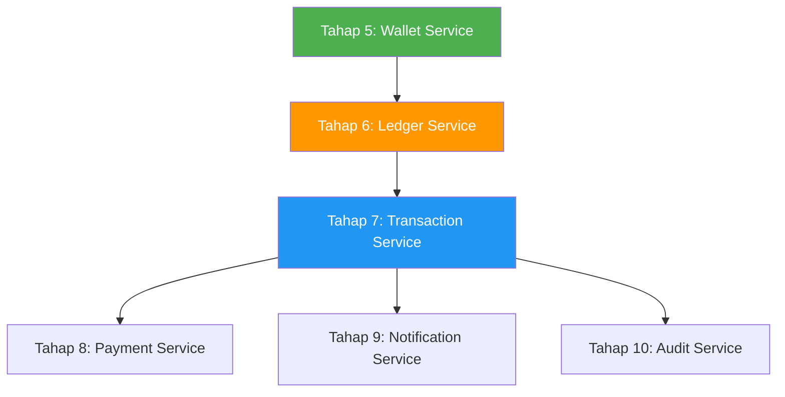

# Review Roadmap GoWallet Microservice

## Verdict: ✅ Secara Garis Besar Make Sense, tapi Ada Beberapa Catatan Penting

Roadmap kamu sudah **mencover hampir semua fitur** yang disebutkan di dokumen arsitektur. Urutannya juga secara umum masuk akal — fondasi dulu, lalu service-service inti, lalu cross-cutting concerns. Berikut review detail per aspek:

---

## 1. Kelengkapan vs Dokumen Arsitektur

### ✅ Sudah Tercakup
| Fitur di PDF | Tahap di Roadmap |
|---|---|
| Ledger Service (immutable, double-entry) | Tahap 6 |
| API Versioning, Correlation ID | Tahap 2 |
| JWT, Refresh Token, Google OAuth | Tahap 3 |
| Idempotency Key | Tahap 7 |
| Optimistic Locking | Tahap 5 |
| Outbox Pattern | Tahap 7 |
| DLQ, Retry Queue | Tahap 13 |
| Circuit Breaker | Tahap 14 |
| ELK, Prometheus, Grafana | Tahap 1 & 12 |
| OpenTelemetry + Jaeger | Tahap 12 |
| Scheduled Cleanup Jobs | Tahap 11 |
| Swagger/OpenAPI | Tahap 3 |
| Soft Delete | Tahap 4 |

### ❌ Belum Ada di Roadmap (Ada di PDF)

| Fitur di PDF | Catatan |
|---|---|
| **RBAC (Role-Based Access Control)** | Tidak disebutkan di tahap manapun. Ini penting untuk admin vs user biasa. |
| **Postman Collection** | PDF menyebutkan ini sebagai dokumentasi. |
| **Integration Test** | Hanya Unit Test di Tahap 3. Integration & E2E test tidak dijadwalkan. |
| **Test Coverage Report** | Tidak disebutkan. |
| **Liveness Check (`/live`)** | Tahap 2 hanya menyebutkan `/health` dan `/ready`, tapi PDF juga menyebutkan `/live`. |
| **Scheduler/Worker: Scheduled Report** | Ada di Tahap 11, tapi tidak jelas apakah ini termasuk "report" yang dimaksud PDF. |

---

## 2. Masalah Urutan (Ordering Issues)

### ⚠️ Observability Terlalu Terlambat (Tahap 12)

> [!WARNING]
> Kamu setup ELK, Prometheus, Grafana di **Tahap 1** (infra), tapi integrasi ke service baru di **Tahap 12**. Ini berarti dari Tahap 2-11, kamu develop tanpa observability yang proper. **Debug akan sangat sulit.**

**Rekomendasi:** Pindahkan structured logging + basic Prometheus metrics ke **Tahap 2 (API Gateway)** dan terapkan secara incremental di setiap service berikutnya. Tahap 12 bisa jadi tahap "advanced observability" (tracing, dashboard tuning).

### ⚠️ RabbitMQ Lanjutan (Tahap 13) vs Notification Service (Tahap 9)

> [!IMPORTANT]
> Notification Service (Tahap 9) consume dari RabbitMQ, tapi DLQ, retry queue, dan poison message handling baru di Tahap 13. Artinya Notification Service awalnya **tanpa error handling yang proper** untuk message consumption.

**Rekomendasi:** Pindahkan DLQ dan basic retry ke **sebelum Tahap 9**, atau minimal buat versi sederhana di Tahap 9 dan lakukan enhancement di Tahap 13.

### ⚠️ Reliability (Tahap 14) Seharusnya Lebih Awal

> [!IMPORTANT]
> Circuit breaker, retry policy, timeout, dan graceful shutdown adalah **cross-cutting concerns** yang seharusnya sudah ada sejak service pertama berkomunikasi satu sama lain (Tahap 5-7). Menambahkan ini di Tahap 14 berarti harus refactor semua service.

**Rekomendasi:** Implement graceful shutdown + timeout sejak Tahap 2. Circuit breaker dan retry policy sejak Tahap 5 (saat service mulai saling panggil).

---

## 3. Dependency yang Perlu Diperhatikan

> [!NOTE]
> Urutan dependency service sudah benar: Auth → User → Wallet → Ledger → Transaction → Payment/Notification/Audit. **Ini bagus.**

Tapi ada satu hal: **Ledger Service (Tahap 6) secara arsitektur seharusnya dibuat sebelum atau bersamaan dengan Wallet Service (Tahap 5)**, karena menurut PDF:

> *"Saldo wallet dapat dihitung dari akumulasi entri ledger"*

Artinya Wallet Service **bergantung** pada Ledger Service untuk menghitung saldo. Jika kamu buat Wallet dulu tanpa Ledger, kamu harus refactor nanti.

---

## 4. Hal-hal yang Bagus 👍

- **Outbox Pattern di Transaction Service** — ini benar, bukan langsung publish ke RabbitMQ
- **Idempotency Key** — penting untuk mencegah duplikasi transfer
- **Optimistic Locking** — benar untuk concurrent saldo update
- **Freeze/Unfreeze wallet** — fitur yang sering dilupakan, bagus sudah ada
- **Soft Delete** — good practice
- **gRPC untuk internal** — sesuai arsitektur PDF

---

## 5. Rekomendasi Urutan yang Lebih Baik

Berikut reorder yang saya sarankan:

| No | Tahap | Perubahan |
|---|---|---|
| 1 | Fondasi | ✅ Sama, tapi tambahkan shared middleware (timeout, graceful shutdown) |
| 2 | API Gateway | ✅ Sama, tambahkan `/live` dan structured logging |
| 3 | Auth Service | ✅ Sama, tambahkan RBAC |
| 4 | User Service | ✅ Sama |
| 5 | **Ledger Service** | ⬆️ Pindah ke sebelum Wallet |
| 6 | **Wallet Service** | ⬇️ Setelah Ledger, saldo dihitung dari ledger |
| 7 | Transaction Service | ✅ Sama |
| 8 | **RabbitMQ Lanjutan** | ⬆️ DLQ & retry sebelum service yang consume |
| 9 | Payment Service | ✅ Sama |
| 10 | Notification Service | ✅ Sama, sekarang sudah punya DLQ |
| 11 | Audit Service | ✅ Sama |
| 12 | Scheduler/Worker | ✅ Sama |
| 13 | **Reliability** | ⬆️ Atau lebih baik diintegrasikan incremental |
| 14 | Observability Lanjutan | Tracing, dashboard tuning |
| 15 | CI/CD & Deployment | ✅ Sama |

---

## 6. Items yang Perlu Ditambahkan

- [ ] **RBAC** — di Auth atau User Service
- [ ] **Liveness check (`/live`)** — di API Gateway
- [ ] **Integration Test** — minimal untuk flow transfer end-to-end
- [ ] **Postman Collection** — untuk dokumentasi API
- [ ] **Test Coverage Report** — sebagai quality gate di CI/CD
- [ ] **Database Migration Tool** — (misalnya `golang-migrate`) belum disebutkan, tapi sangat penting
- [ ] **API Documentation per service** — Swagger hanya di Auth, bagaimana service lain?

---

## Kesimpulan

| Aspek | Nilai |
|---|---|
| Kelengkapan fitur | ⭐⭐⭐⭐ (90%) — beberapa item minor tertinggal |
| Urutan/dependency | ⭐⭐⭐ (70%) — Ledger↔Wallet perlu diswap, reliability terlalu akhir |
| Practicality | ⭐⭐⭐⭐ (85%) — realistis untuk dikerjakan bertahap |
| Production-readiness | ⭐⭐⭐⭐ (80%) — perlu RBAC, migration tool, dan testing strategy |

> [!TIP]
> Roadmap ini sudah **sangat solid** sebagai panduan development. Dengan adjustment urutan Ledger↔Wallet dan memajukan reliability/observability, ini akan jadi roadmap yang production-grade.
